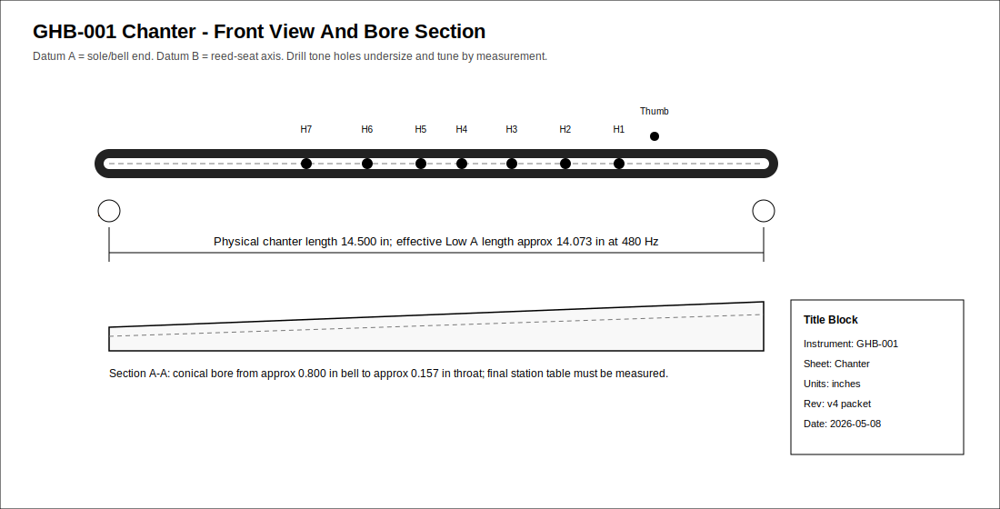
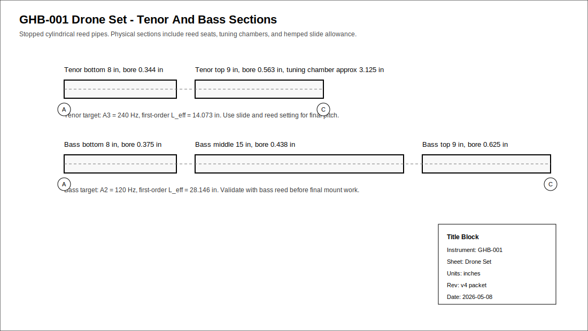
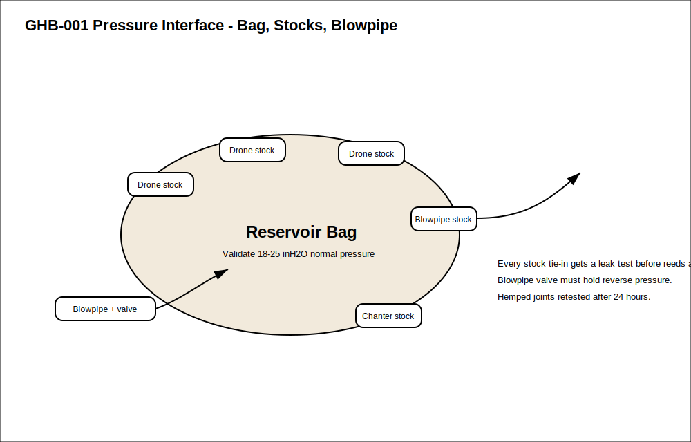
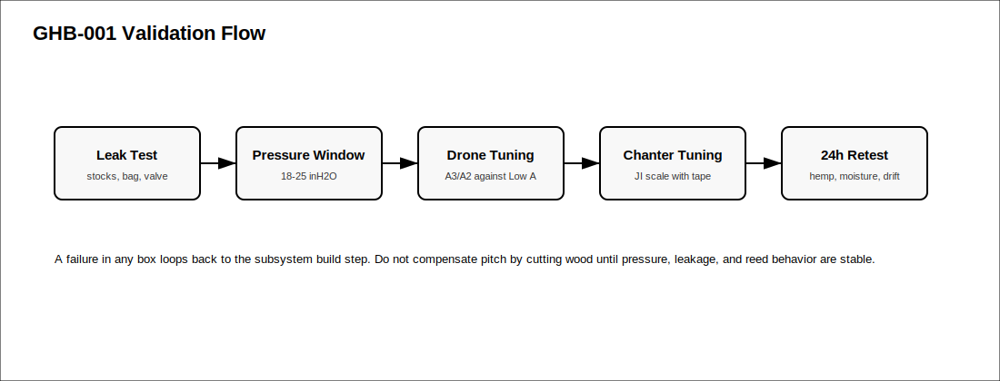

# Great Highland Bagpipe Capstone
- Musical instrument documentation capstone
- Build packet: great-highland-bagpipe
- Generated: 2026-05-08

---

# Project Intent
- Build a first-pass engineering packet for a complete Great Highland Bagpipe set
that exposes the system interactions: chanter bore and reed, drones and drone
reeds, bag pressure, stocks, blowpipe valve, tuning slides, sourcing,
maintenance, and validation. The goal is not to claim a finished concert-grade
set from formulas alone; it is to define the measured build loop that gets from
workbook geometry to a playable, serviceable prototype.

_Speaker notes:_ Read design.md before committing to dimensions or sourcing decisions.

---

# Physics Model
- The Great Highland Bagpipe is a coupled reed/resonator/reservoir system. The
packet intentionally uses different first-order models for different
subsystems, then validates the coupled result under pressure.

```
f_chanter ~= c / (2 * L_eff)
L_eff ~= c / (2 * f_target)
c = speed of sound in inches per second
```

```
Low A = 480 Hz
c = 13510 in/s
L_eff = 13510 / (2 * 480) = 14.073 in
Workbook physical full chanter length = 14.5 in
```

```
f_drone ~= c / (4 * L_eff)
L_eff ~= c / (4 * f_target)
```

```
Tenor drone A3 = 240 Hz
L_eff = 13510 / (4 * 240) = 14.073 in

Bass drone A2 = 120 Hz
L_eff = 13510 / (4 * 120) = 28.146 in
```

```
cents_error = 1200 * log2(measured_hz / target_hz)
pressure_target = 18-25 inH2O for first prototype testing
```

_Speaker notes:_ Governing equations extracted verbatim from design.md. Apply empirical corrections (NAF K2, scale offsets) only where the model permits — see references/acoustic-models.md.

---

# Hardware Alignment

| Operation | Tooling | Fixture | Notes |
| --- | --- | --- | --- |
| Chanter exterior turning | Lathe roughing/detail tools | Between centers, then chuck/collet | Leave extra length for holding and trimming |
| Chanter conical bore | Step drills plus custom tapered reamer | Headstock-driven deep bore setup | Bore straightness is a high-risk acoustic variable |
| Tone holes | Drill press or mill, undersize bits | V-block indexed to front/back datum | Open by reaming/sanding while measuring pitch |
| Drone cylindrical bores | Long brad-point/twist drills, reamers | Lathe center drilling and steady rest | Build one tenor as process proof |
| Tuning slides | Lathe turning and parting tools | Matched tenon/socket gauges | Hemp clearance must be planned, not guessed |
| Stocks | Lathe boring tools | Batch fixture for repeated stock bodies | Tie-in groove must not cut too deep |
| Mounts/ferrules | Lathe, optional laser engraving | Mandrels for Delrin/ferrule rings | Keep decorative parts removable in prototype |

_Speaker notes:_ Identifies which shop pipeline(s) this instrument lives in: Bambu+kiln slip-cast, 40W laser flat-pack, CNC+lathe, segmented turning, drum-skin work, or hybrid combinations.

---

# How To Use This Packet
- Start with design.md for intent and assumptions.
- Use bom.csv, sourcing.csv, and cut-list.csv before buying or cutting.
- Use drawing-brief.md and CAD/CNC folders before machining.
- Print the packet for shopping, shop work, and validation.

---

# File Map
- design.md: Project intent, catalog metadata, assumptions, and validation plan.
- bom.csv: Starter bill of materials with part categories, quantities, drawing refs, and notes.
- sourcing.csv: Supplier/search tracker with specs, price/date fields, lead time, substitutes, and risks.
- cut-list.csv: Rough/final stock sizes, material, grain/orientation, operations, yield, and offcuts.
- drawing-brief.md: Manufacturing drawing and technical product sketch brief.
- assembly-manual.md: Shop-facing sequence, tools, fixtures, safety, tuning, finishing, and maintenance notes.
- validation.csv: Target/measured values, tolerance, environment, result, and tuning/build action log.
- supplier-rfq.md: Supplier email/request-for-quote starter.

---

# Family Spec

| member_id | subsystem | target_note | target_hz | predicted_length_in | bore_in | role | prototype_priority |
| --- | --- | --- | --- | --- | --- | --- | --- |
| GHB-CHANTER | chanter | Low A | 480 | 14.5 | 0.157-0.800 conical | melody pipe | 1 |
| GHB-TENOR-1 | drone | A3 | 240 | 17.0 | 0.344/0.563 stepped | tenor drone reference | 2 |
| GHB-TENOR-2 | drone | A3 | 240 | 17.0 | 0.344/0.563 stepped | second tenor unison | 3 |
| GHB-BASS | drone | A2 | 120 | 32.0 | 0.375/0.438/0.625 stepped | bass drone reference | 4 |
| GHB-BLOWPIPE | pressure | pressure supply |  | 12.0 | 0.500 | air inlet and valve | 5 |
| GHB-STOCKS | interface | airtight fit |  | 3.0 | 0.813 nominal | bag interface set | 6 |

_Speaker notes:_ Sizes scale via the master scale factor; tuning targets are first-order Helmholtz/cantilever predictions to be empirically corrected per prototype.

---

# Build Workflow
- Design and assumptions
- Source materials and hardware
- Prepare stock, fixtures, and CNC/laser/lathe setup
- Assemble, tune, finish, and validate

---

# Sourcing And BOM
- BOM gives part categories and drawing references.
- Sourcing tracks search terms, supplier candidates, price/date, lead time, substitutions.
- Visual BOM brief turns the parts list into a presentation-ready image board.

---

# Shop Packet
- Cut list for lumber/sheet/blank planning.
- Assembly manual for away-from-keyboard work.
- Validation sheet for measured dimensions, tuning, pass/fail checks.

---

# Drawings, CAD, CNC
- drawing-brief.md defines required views, dimensions, datums, sketch intent.
- cad/ holds models and design tables.
- cnc/ holds CAM, toolpaths, setup sheets, dry-run notes.
- drawings/ holds PDFs, SVGs, DXFs, drawing exports.






---

# Images And Screenshots
- images/ghb-system-map.svg


---

# Validation Plan
- A4 = 440 Hz reference check.
- Tuning targets logged in validation.csv.
- Critical dimensions verified against design sheet and CAD.
- Photos and revision notes after each major step.

---

# Open Risks / Decisions
- TBDs in design sheet and BOM.
- Supplier price/availability not yet verified.
- Generated images marked as concept placeholders.
- Empirical corrections await measured prototype data.

---

# Next Actions
- Replace TBDs with measured/source-backed values.
- Verify live supplier price and availability before buying.
- Export final drawings and visual BOM images.
- Regenerate this deck and print packet after final edits.

---
