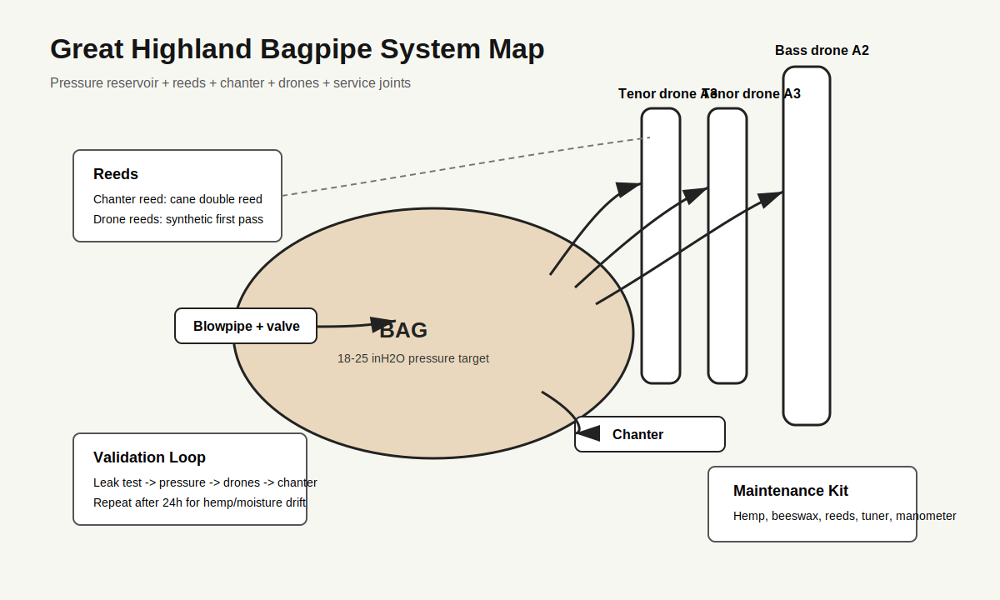

# Great Highland Bagpipe Capstone Print Packet

Generated: 2026-05-08
Packet folder: `/mnt/c/Users/Tony/Documents/GitHub/great-highland-bagpipe`

## File Map

| File | Purpose |
| --- | --- |
| `design.md` | Project intent, catalog metadata, assumptions, and validation plan. |
| `bom.csv` | Starter bill of materials with part categories, quantities, drawing refs, and notes. |
| `sourcing.csv` | Supplier/search tracker with specs, price/date fields, lead time, substitutes, and risks. |
| `cut-list.csv` | Rough/final stock sizes, material, grain/orientation, operations, yield, and offcuts. |
| `drawing-brief.md` | Manufacturing drawing and technical product sketch brief. |
| `assembly-manual.md` | Shop-facing sequence, tools, fixtures, safety, tuning, finishing, and maintenance notes. |
| `validation.csv` | Target/measured values, tolerance, environment, result, and tuning/build action log. |
| `supplier-rfq.md` | Supplier email/request-for-quote starter. |
| `visual-bom-brief.md` | Art direction for an image-forward visual BOM. |
| `great-highland-bagpipe-starter.wl` | Wolfram starter for physics, optimization, visualization, and validation. |
| `README.md` | Project artifact. |
| `family-spec.csv` | Project artifact. |
| `photo-shotlist.md` | Project artifact. |
| `risks.md` | Project artifact. |

<div class="page-break"></div>

## design.md

Project intent, catalog metadata, assumptions, and validation plan.

# Great Highland Bagpipe Build Packet

## Intent

Build a first-pass engineering packet for a complete Great Highland Bagpipe set
that exposes the system interactions: chanter bore and reed, drones and drone
reeds, bag pressure, stocks, blowpipe valve, tuning slides, sourcing,
maintenance, and validation. The goal is not to claim a finished concert-grade
set from formulas alone; it is to define the measured build loop that gets from
workbook geometry to a playable, serviceable prototype.

## Catalog Metadata

| Field | Value |
| --- | --- |
| Instrument ID | GHB-001 |
| Slug | great-highland-bagpipe |
| Family | reed |
| Pipeline | cnc-lathe |
| Reference workbook | `great-highland-bagpipe-design-table.xlsx` |
| Done-bar family | reed woodwinds, closest local sisters: `chalumeau`, `duduk` |
| Date | 2026-05-08 |

## Design Inputs

| Parameter | Workbook value | Notes |
| --- | ---: | --- |
| Chanter Low A | 480 Hz | Modern GHB pitch, not A440 concert pitch |
| Speed of sound | 13510 in/s | Workbook value, roughly room-temperature air |
| Chanter scale | Mixolydian-like, just intonation | Tuned to drones, not equal temperament |
| Wood reference | African blackwood | Ipe, cocobolo, Delrin, maple, cherry, walnut are prototype alternatives |
| Drone tuning | two A3 tenors, one A2 bass | Tenors one octave below Low A; bass two octaves below |
| Bag pressure | 18-25 inH2O first-pass range | Pressure changes reed pitch and stability |

## Governing Model

The Great Highland Bagpipe is a coupled reed/resonator/reservoir system. The
packet intentionally uses different first-order models for different
subsystems, then validates the coupled result under pressure.

### Chanter

The chanter is a conical bore driven by a double reed. A conical reed pipe
behaves closer to an open-open pipe for pitch than a cylindrical stopped pipe,
but tone holes, reed compliance, and bore taper dominate the final intonation.
The workbook dimensions and measured practice-chanter hole positions are the
starting geometry.

```text
f_chanter ~= c / (2 * L_eff)
L_eff ~= c / (2 * f_target)
c = speed of sound in inches per second
```

Worked example from the workbook:

```text
Low A = 480 Hz
c = 13510 in/s
L_eff = 13510 / (2 * 480) = 14.073 in
Workbook physical full chanter length = 14.5 in
```

The difference between effective and physical length is expected because the
reed seat, conical end behavior, bell flare, and tone-hole network all shift the
effective acoustic length. Final tuning must start with undersize holes and
open them by measurement.

### Drones

The drones are cylindrical single-reed pipes, closed at the reed end and open at
the top. They are first-pass stopped pipes with odd-harmonic emphasis.

```text
f_drone ~= c / (4 * L_eff)
L_eff ~= c / (4 * f_target)
```

Worked examples from the workbook:

```text
Tenor drone A3 = 240 Hz
L_eff = 13510 / (4 * 240) = 14.073 in

Bass drone A2 = 120 Hz
L_eff = 13510 / (4 * 120) = 28.146 in
```

The workbook's physical sections intentionally exceed or subdivide these
effective lengths because tuning chambers, hemped slides, reed seats, and cap
geometry move the acoustic endpoint.

### Bag Pressure And Reeds

The bag is a pressure reservoir, not just a container. The reed only oscillates
inside a stable pressure window. Pressure changes can sharpen or destabilize
the chanter and drones, so every tuning row in `validation.csv` includes
environment and pressure notes.

```text
cents_error = 1200 * log2(measured_hz / target_hz)
pressure_target = 18-25 inH2O for first prototype testing
```

### Empirical Correction Guard

No Native American flute K2 correction is applied here. This packet uses
first-order conical/stopped-pipe estimates plus measured GHB-specific
validation rows. Any future correction must be derived from measured chanter,
drone, reed, and pressure data from this family.

## Chanter Scale Table

| Note | Ratio to Low A | Target Hz at Low A 480 | Model L_eff in | Prototype action |
| --- | ---: | ---: | ---: | --- |
| Low G | 8/9 | 426.67 | 15.832 | Validate as cross/fingering-dependent low note |
| Low A | 1/1 | 480.00 | 14.073 | Establish reed strength and pressure first |
| B | 9/8 | 540.00 | 12.509 | Drill undersize, tape-tune up |
| C written C# | 5/4 | 600.00 | 11.258 | Drill undersize, tune against drones |
| D | 4/3 | 640.00 | 10.555 | Check just fourth against drones |
| E | 3/2 | 720.00 | 9.382 | Watch high hand spacing and hole size |
| F written F# | 5/3 | 800.00 | 8.444 | Small tuning changes are sensitive |
| High G | 7/4 | 840.00 | 8.042 | Treat as cross-fingering/harmonic validation |
| High A | 2/1 | 960.00 | 7.036 | Validate as octave behavior, not a simple hole row |

## Subsystem Interfaces

| Interface | Critical fit | Validation |
| --- | --- | --- |
| Chanter reed to chanter seat | Airtight staple fit, stable blade opening | Reed seats without wobble; Low A speaks at target pressure |
| Chanter stock to bag | Stock tie-in and hemp seal | No bubbles in leak test |
| Drone reed to drone seat | Reed body matches seat diameter | Reed starts, cuts off, and restarts predictably |
| Drone slides | Hemped tenon/socket with tuning travel | Smooth movement, no air loss, no sudden pitch jumps |
| Blowpipe valve | One-way seal | Bag holds pressure when player stops blowing |
| Bag to stocks | Mechanical tie-in | 60-second pressure hold test |

## Hardware Alignment

| Operation | Tooling | Fixture | Notes |
| --- | --- | --- | --- |
| Chanter exterior turning | Lathe roughing/detail tools | Between centers, then chuck/collet | Leave extra length for holding and trimming |
| Chanter conical bore | Step drills plus custom tapered reamer | Headstock-driven deep bore setup | Bore straightness is a high-risk acoustic variable |
| Tone holes | Drill press or mill, undersize bits | V-block indexed to front/back datum | Open by reaming/sanding while measuring pitch |
| Drone cylindrical bores | Long brad-point/twist drills, reamers | Lathe center drilling and steady rest | Build one tenor as process proof |
| Tuning slides | Lathe turning and parting tools | Matched tenon/socket gauges | Hemp clearance must be planned, not guessed |
| Stocks | Lathe boring tools | Batch fixture for repeated stock bodies | Tie-in groove must not cut too deep |
| Mounts/ferrules | Lathe, optional laser engraving | Mandrels for Delrin/ferrule rings | Keep decorative parts removable in prototype |

## Build Strategy

Prototype order is deliberately reeds-first and pressure-first:

1. Buy three chanter reeds and one synthetic drone reed set.
2. Buy a synthetic zipper bag and blowpipe valve before final tuning work.
3. Build a practice/prototype chanter in cherry, walnut, ipe, or Delrin.
4. Validate bore, reed, and hole tuning before building African blackwood.
5. Build one tenor drone, then duplicate it after measured success.
6. Build the bass drone after slide and reed behavior are stable.
7. Tie in stocks, run leakage tests, and maintain a tuning/pressure log.

## Assumptions And Unknowns

| Item | Status | Why it matters |
| --- | --- | --- |
| Chanter bore station table | Derived from workbook and practice measurements | Final intonation needs measured stations, not only a linear cone |
| Reed brand/strength | Unknown until purchased | Reed compliance changes pitch, pressure, and response |
| Bag actual volume | Supplier-dependent | Affects stability and ergonomic squeeze behavior |
| Drone reed seat dimensions | Must match chosen reeds | Synthetic reed body diameters vary |
| Final decorative mount dimensions | Flexible | Do not let ornament drive acoustic or service dimensions |

## Validation Plan

Validation starts with the subsystem, then moves to the coupled system:

1. Bench leak test every stock, reed seat, slide, and bag tie-in.
2. Measure pressure at start, normal play, and cut-off for chanter and drones.
3. Tune drones without the chanter, then add chanter and listen for beating.
4. Record note frequency, cents error, pressure, temperature, humidity, reed,
   and corrective action in `validation.csv`.
5. Repeat after 24 hours to catch hemp compression, bag leakage, and moisture
   effects.

<div class="page-break"></div>

## bom.csv

Starter bill of materials with part categories, quantities, drawing refs, and notes.

| item_id | assembly | part | qty | material_spec | operation | source_or_supplier | search_terms | substitute_rule | drawing_ref | estimated_cost | notes |
| --- | --- | --- | --- | --- | --- | --- | --- | --- | --- | --- | --- |
| BOM-001 | Chanter | Full chanter blank | 1 | African blackwood 2x2x16 in minimum; prototype in ipe Delrin cherry or walnut | Turn exterior; bore; ream; drill holes | Gilmer Wood; Bell Forest; Cook Woods | African blackwood turning blank 2x2x18 | Use Delrin or ipe for first prototype; avoid final blackwood until bore workflow is proven | drawings/ghb-chanter-front.svg | 40-80 | Workbook recommends cheaper practice material first |
| BOM-002 | Drones | Tenor drone section blanks | 4 | African blackwood or Delrin 2x2x10 in | Turn; bore; tenon/socket; hemp slides | Gilmer Wood; Bell Forest; Cook Woods; plastics supplier | blackwood drone blank Delrin rod 2 inch | Build one tenor first then duplicate after validation | drawings/ghb-drone-set.svg | 80-180 | Two bottoms and two tops |
| BOM-003 | Drones | Bass drone section blanks | 3 | African blackwood or Delrin 2x2x10 and 2x2x16 in | Turn; bore; tenon/socket; hemp slides | Gilmer Wood; Bell Forest; Cook Woods | blackwood bass drone blank | Use Delrin for geometry proof if blackwood cost is limiting | drawings/ghb-drone-set.svg | 70-170 | Bottom middle and top sections |
| BOM-004 | Stocks | Stock blanks | 5 | African blackwood or Delrin 2x2x4 in | Turn bore and tie-in groove | Same as wood/plastic supplier | bagpipe stock blank Delrin blackwood | All stocks can be prototype Delrin for serviceability | drawings/ghb-pressure-interface.svg | 30-60 | Chanter stock blowpipe stock and three drone stocks |
| BOM-005 | Blowpipe | Blowpipe blank and mouthpiece | 1 | Blackwood or Delrin body with plastic mouthpiece | Turn straight bore and valve seat | Bagpipe supplier or plastics supplier | bagpipe blowpipe mouthpiece valve | Buy valve/mouthpiece if turning body only | drawings/ghb-pressure-interface.svg | 20-40 | Includes one-way valve interface |
| BOM-006 | Bag | Synthetic zipper bag | 1 | Bannatyne Canmore Ross or equivalent | Buy ready-made; tie in stocks | Henderson's; National Piping Centre shop | synthetic highland bagpipe bag zipper | Use synthetic for first validation because leak behavior is repeatable | images/ghb-system-map.svg | 80-120 | Actual price/date must be checked before purchase |
| BOM-007 | Reeds | Chanter reeds | 3 | Cane double reeds | Fit and test | G1; Chesney; Melvin; Husk | highland bagpipe chanter reed medium | Buy multiple strengths; do not make first reeds | validation.csv | 45-75 | Reed selection dominates response |
| BOM-008 | Reeds | Synthetic drone reed set | 1 | Two tenor plus one bass synthetic set | Fit; tune bridles/screws | Ezeedrone; Kinnaird; Canning | highland bagpipe synthetic drone reeds set | Cane reeds optional after system is stable | validation.csv | 40-80 | Reduces prototype variability |
| BOM-009 | Hardware | Hemp and beeswax | 1 spool | Waxed yellow hemp plus beeswax | Wrap joints and reed seats | Bagpipe supplier | waxed hemp bagpipe beeswax | None; fit depends on hemp | assembly-manual.md | 5-10 | Track compression during 24-hour retest |
| BOM-010 | Decorative mounts | Imitation ivory mounts and ferrules | 1 set | Delrin imitation ivory or nickel silver | Turn or buy; polish; optional engraving | Bagpipe supplier or plastics supplier | bagpipe projecting mounts imitation ivory | Prototype may omit decoration | drawings/ghb-drone-set.svg | 30-80 | Decoration must not block service access |
| BOM-011 | Tooling | Chanter tapered reamer | 1 | 0.13 to 0.87 in taper approx | Buy custom or grind; use with lathe support | Custom toolmaker or woodwind tool supplier | bagpipe chanter reamer tapered | No safe substitute for final bore; prototype can use measured stepped tests | drawing-brief.md | 50-150 | High-risk tool |
| BOM-012 | Accessories | Cord tassels and cover | 1 set | Tartan cover cords ribbons | Buy after prototype plays | Bagpipe supplier | highland bagpipe cover cord tassels | Optional during acoustic validation | visual-bom-brief.md | 50-100 | Keep out of first acoustic tests |

<div class="page-break"></div>

## sourcing.csv

Supplier/search tracker with specs, price/date fields, lead time, substitutes, and risks.

| component | required_spec | preferred_supplier | search_terms | date_checked | price_each | lead_time | substitutions | risk_notes |
| --- | --- | --- | --- | --- | --- | --- | --- | --- |
| Chanter blank | 2x2x16 in dense stable turning blank African blackwood or prototype material | Gilmer Wood; Bell Forest; Cook Woods | African blackwood 2x2x18 turning blank |  |  | Ipe Delrin hard maple cherry walnut | Blackwood is expensive and can crack or move if poorly dried |  |
| Drone blanks | 2x2 in dense stable blanks in 10 and 16 in lengths | Gilmer Wood; Bell Forest; Cook Woods | African blackwood bagpipe drone blank |  |  | Delrin or cocobolo | Seven drone pieces create cost and yield risk |  |
| Delrin rod | 2 in acetal/Delrin rod for prototype chanter drones and stocks | Industrial plastic supplier | 2 inch black acetal rod Delrin |  |  | Blackwood after geometry proof | Dimensionally stable but less traditional tone/feel |  |
| Synthetic bag | Highland bagpipe synthetic zipper bag with five stock positions | Henderson's; National Piping Centre; bagpipe shops | Bannatyne Canmore Ross synthetic bagpipe bag |  |  | Sheepskin or hybrid bag | Supplier sizing and stock-hole layout must match plan |  |
| Chanter reeds | Medium-strength Highland chanter reeds three-count mix | G1; Chesney; Melvin; Husk | highland bagpipe chanter reed medium |  |  | Buy mixed strengths from two makers | Single reed choice can make the chanter appear wrong |  |
| Drone reeds | Synthetic set with two tenors and one bass | Ezeedrone; Kinnaird; Canning | highland bagpipe synthetic drone reeds set |  |  | Cane drone reeds later | Synthetic dimensions may drive reed seat sizing |  |
| Waxed hemp | Yellow waxed hemp and beeswax | Bagpipe supplier | waxed hemp bagpipe beeswax |  |  | None | Joint fit depends on wrap quality and compression over time |  |
| Blowpipe valve | One-way blowpipe valve leather flap or ball valve | Bagpipe supplier | bagpipe blowpipe valve replacement |  |  | Buy complete blowpipe for reference | Air backflow makes pressure validation impossible |  |
| Mount material | Imitation ivory Delrin rod or bought projecting mounts | Bagpipe supplier; plastics supplier | bagpipe imitation ivory mounts Delrin rod |  |  | Omit on prototype | Decoration can consume budget before acoustic risk is retired |  |
| Custom reamer | Chanter taper reamer matching bore plan | Woodwind toolmaker or custom grinder | bagpipe chanter reamer custom tapered |  |  | Prototype step-bore test only | Incorrect taper can ruin every chanter attempt |  |

<div class="page-break"></div>

## cut-list.csv

Rough/final stock sizes, material, grain/orientation, operations, yield, and offcuts.

| part_id | assembly | qty | material | rough_dimensions_in | final_dimensions_in | grain_or_orientation | operation | yield_or_offcut_plan | notes |
| --- | --- | --- | --- | --- | --- | --- | --- | --- | --- |
| CUT-001 | Chanter | 1 | African blackwood or prototype Delrin/ipe/cherry | 2 x 2 x 16.5 | OD 0.88 reed seat to 1.25 bell; length 14.5 | Straight grain along bore; avoid defects | Turn exterior; drill/ream conical bore; drill tone holes | Save offcut for reed-seat and finish tests | Leave extra length until bore and reed seat are proven |
| CUT-002 | Tenor bottom sections | 2 | African blackwood or Delrin | 2 x 2 x 10 | 8.0 long; bore 0.344 nominal | Grain along bore | Turn; bore; make tenon/socket | Pair offcuts for slide gauges | Build first tenor bottom as setup proof |
| CUT-003 | Tenor top sections | 2 | African blackwood or Delrin | 2 x 2 x 10 | 9.0 long; bore 0.563 nominal | Grain along bore | Turn; bore; chamber; cap feature | Use matching offcuts for cap tests | Tenors should be identical after validation |
| CUT-004 | Bass bottom | 1 | African blackwood or Delrin | 2 x 2 x 10 | 8.0 long; bore 0.375 nominal | Grain along bore | Turn; bore; tenon/socket | Save bore plug sample | Validate before bass middle |
| CUT-005 | Bass middle | 1 | African blackwood or Delrin | 2 x 2 x 16 | 15.0 long; bore 0.438 nominal | Grain along bore | Turn; long bore; tenon/socket | Plan center-drill from both ends if needed | Highest long-bore wander risk |
| CUT-006 | Bass top | 1 | African blackwood or Delrin | 2 x 2 x 10 | 9.0 long; bore 0.625 nominal | Grain along bore | Turn; bore; chamber/cap feature | Use offcut for cap test | Match drone top visual language |
| CUT-007 | Stocks | 5 | African blackwood or Delrin | 2 x 2 x 4 each | 2.5-3.0 long; bore to mating part; tie-in groove | Grain along bore | Batch turn and bore | Make one extra stock blank | Groove depth must preserve wall strength |
| CUT-008 | Blowpipe | 1 | African blackwood or Delrin | 2 x 2 x 14 | 10-12 long; bore 0.5 nominal | Grain along bore | Turn; bore; valve seat; mouthpiece fit | Offcut for valve seat test | Valve must seal before full assembly |
| CUT-009 | Mounts/ferrules | 1 set | Delrin imitation ivory or nickel silver rod | As required by profile | Fit to each section | Neutral; avoid stress fit | Turn rings and ferrules | Prototype can omit | Do not glue permanently until tuning slides are proven |
| CUT-010 | Fixture gauges | 1 set | Hardwood or Delrin scraps | Shop offcuts | Reed seat gauges; tenon gauges; bore check plugs | Stable material | Turn gauges before final parts | Reuse across builds | Gauges reduce repeated measurement error |

<div class="page-break"></div>

## drawing-brief.md

Manufacturing drawing and technical product sketch brief.

# Drawing Brief

## Drawing Set

| Drawing | Purpose | Required datums |
| --- | --- | --- |
| `drawings/ghb-chanter-front.svg` | Chanter body, tone-hole datum chain, bore section | Datum A = sole/bell end, Datum B = reed seat axis, Datum C = front hole line |
| `drawings/ghb-drone-set.svg` | Tenor and bass section lengths, bores, tuning-slide interfaces | Datum A = reed seat end, Datum B = slide shoulder, Datum C = sound exit |
| `drawings/ghb-pressure-interface.svg` | Bag, stocks, blowpipe, valve, pressure path | Datum A = bag centerline, Datum B = stock tie-in groove |
| `drawings/ghb-system-validation.svg` | Validation flow: pressure, leak, drone tuning, chanter tuning, maintenance retest | Datum A = subsystem test order |

## Standards

- Units: inches with metric equivalents added later where useful.
- Default tolerance: +/-0.005 in for turned acoustic features; +/-0.015 in for
  decorative exterior features; fit-specific tolerances must be measured from
  purchased reeds and bag hardware.
- Critical dimensions must trace to `great-highland-bagpipe-design-table.xlsx`
  or measured supplier parts.
- Any reed-seat or stock dimension not measured yet is marked "measure chosen
  part" rather than guessed.

## Chanter Notes

The tone-hole coordinates in the workbook include measured practice-chanter
locations and first-pass target full-chanter values. The drawing must show
undersize drill diameters and leave final tuning by measurement.

## Drone Notes

Drone drawings must show effective acoustic length separately from physical
section length. Tuning slides, reed seats, and cap geometry move the acoustic
endpoint.

<div class="page-break"></div>

## assembly-manual.md

Shop-facing sequence, tools, fixtures, safety, tuning, finishing, and maintenance notes.

# Great Highland Bagpipe Assembly Manual

## Shop Principle

Do not build the ornate final set first. Bagpipes are a pressure-coupled reed
system; a beautiful bore that cannot be tuned with the chosen reeds is scrap.
Retire reed, pressure, and leakage risk before committing expensive blackwood.

## Tools And Fixtures

- Lathe with chuck/collet support, tailstock drill chuck, live center, and
  steady rest for long sections.
- Step-drill set, long bits, reamers, bore gauges, and a purpose-made chanter
  taper reamer.
- V-block or indexed drill fixture for chanter tone holes.
- Manometer for bag pressure.
- Calipers, small bore gauges, tuner, tape, beeswax, waxed hemp, and leak-test
  solution.
- Reed-seat and tenon/socket gauges turned from stable offcuts.

## Phase 0 - Buy The Coupling Parts

1. Buy at least three commercial chanter reeds before finalizing the reed seat.
2. Buy a synthetic drone reed set.
3. Buy or borrow a synthetic zipper bag and a blowpipe valve.
4. Measure reed body/staple diameters and update `validation.csv`.

## Phase 1 - Prototype Chanter

1. Rough-turn the blank oversized and leave holding allowance at both ends.
2. Establish the bore datum from the reed seat end.
3. Step-drill conservatively, then ream to the planned taper.
4. Turn the exterior only after the bore is confirmed straight enough.
5. Drill tone holes undersize using the datum plan in `drawing-brief.md`.
6. Fit a commercial reed and check Low A at stable pressure.
7. Use tape and incremental enlargement to bring the scale into range.

## Phase 2 - Tenor Drone Proof

1. Build one tenor drone bottom and top.
2. Bore the bottom and top to the workbook dimensions.
3. Turn the tuning slide with planned hemp clearance.
4. Fit a tenor drone reed and find the slide range for A3.
5. Log reed setting, pressure, temperature, and cents error.
6. Duplicate the validated tenor.

## Phase 3 - Bass Drone

1. Build the bass bottom, middle, and top as separate sections.
2. Use a steady rest and center-drill strategy for the long middle section.
3. Bore slightly conservatively where reaming or sanding is planned.
4. Fit the bass drone reed and confirm A2 with usable tuning travel.

## Phase 4 - Stocks, Bag, And Blowpipe

1. Batch-turn five stocks with tie-in grooves.
2. Turn the blowpipe body and fit the one-way valve.
3. Tie the stocks into the synthetic bag.
4. Leak-test each stock before inserting reeds or drones.
5. Assemble all pipes with hemped joints and repeat the leak test.

## Phase 5 - Tuning And Balancing

1. Tune both tenors together at stable pressure.
2. Add the bass drone and tune it against the tenors.
3. Add the chanter and tune Low A against the drone reference.
4. Work upward through the chanter notes, changing one variable at a time.
5. If pressure changes shift multiple notes together, correct pressure/reed
   behavior before changing hole geometry.

## Maintenance Loop

- Before each session: inspect reeds, check hemped joints, confirm blowpipe
  valve seal, and run a short pressure hold.
- After each session: dry moisture from blowpipe and stocks, inspect reed
  seats, and loosen any joint that became too tight.
- Weekly during prototype: repeat drone tuning and bag leak validation.
- After 24 hours: recheck pitch because hemp compression can change slide
  position and air leakage.

## Stop Conditions

Stop and redesign or rebuild the affected part if any of these occur:

- Chanter bore wander is visible or pitch errors cannot be corrected with hole
  size/tape.
- A stock tie-in leaks after two attempts.
- A tuning slide binds before reaching target pitch.
- A reed only speaks outside the expected pressure range.
- Any crack appears around a bore, stock groove, or slide socket.

<div class="page-break"></div>

## validation.csv

Target/measured values, tolerance, environment, result, and tuning/build action log.

| check_id | subsystem | target | formula_or_spec | predicted | measured | units | tolerance | environment | result | action |
| --- | --- | --- | --- | --- | --- | --- | --- | --- | --- | --- |
| VAL-001 | Reference | A4 sanity check | 440*2^((69-69)/12) | 440 |  | Hz | 0 | room | Pending | Confirms frequency formula implementation |
| VAL-002 | Chanter Low A | 480 Hz at stable pressure | c/(2*L_eff) | 480 |  | Hz | +/-10 cents at prototype stage | record temp humidity pressure | Pending | Set reed and pressure before hole tuning |
| VAL-003 | Chanter Low A effective length | c/(2*480) | 14.073 |  | in | +/-0.25 in first-order estimate | room | Pending | Compare with physical 14.5 in body and reed behavior |  |
| VAL-004 | Chanter scale all notes | Just ratios from design.md | c/(2*f_note) | see design.md |  | cents | +/-15 cents prototype; +/-5 cents final | record pressure and reed | Pending | Tune from undersize with tape/enlargement |
| VAL-005 | Tenor drone A3 | 240 Hz | c/(4*240) | 14.073 |  | in effective | +/-0.5 in before slide tuning | room | Pending | Check slide range before duplicate tenor |
| VAL-006 | Tenor drone frequency | 240 Hz with chosen reed | stopped pipe plus reed/slide | 240 |  | Hz | +/-5 cents against chanter Low A | record pressure and reed | Pending | Adjust reed bridle/screw then slide |
| VAL-007 | Bass drone A2 | 120 Hz | c/(4*120) | 28.146 |  | in effective | +/-1.0 in before slide tuning | room | Pending | Confirm bass slide travel and reed stability |
| VAL-008 | Bag pressure | 18-25 inH2O normal play | manometer reading | 18-25 |  | inH2O | +/-2 inH2O | player test | Pending | Log start pressure and cutoff pressure for reeds |
| VAL-009 | Bag leak | Hold pressure for 60 seconds | pressure decay test | no audible leak |  | pass/fail | No audible leak and slow pressure decay | bag assembled | Pending | Soap/bubble or manometer leak locate |
| VAL-010 | Blowpipe valve | No reverse flow | back-pressure test | no backflow |  | pass/fail | No noticeable reverse flow | bag assembled | Pending | Replace or reseat valve if failed |
| VAL-011 | Drone slide fit | Smooth travel airtight | hand force plus leak test | smooth and sealed |  | pass/fail | No binding no leak | hemped joint | Pending | Adjust hemp wrap and wax |
| VAL-012 | Stock tie-in | Five stocks airtight | pull and leak test | secure |  | pass/fail | No stock movement no leak | bag tied | Pending | Retie if movement or bubbles appear |
| VAL-013 | Maintenance 24h retest | Pitch and pressure repeatability | repeat VAL-002 to VAL-012 | within tolerance |  | mixed | +/-5 cents drift target | 24h after assembly | Pending | Identifies hemp compression and moisture drift |

<div class="page-break"></div>

## supplier-rfq.md

Supplier email/request-for-quote starter.

# Supplier RFQ - Great Highland Bagpipe Prototype

Hello,

I am sourcing parts and blanks for a first-pass Great Highland Bagpipe prototype
build. Please quote current price, availability, lead time, and shipping for the
items below. Substitutions are welcome if they preserve the stated critical
dimensions and material behavior.

## Quote Items

| Item | Required spec | Quantity | Notes |
| --- | --- | ---: | --- |
| Chanter blank | African blackwood or comparable dense stable turning blank, 2 x 2 x 16 in minimum | 1 | Straight grain, kiln dried, no checks |
| Drone blanks | Dense stable turning blanks, 2 x 2 x 10 in and 2 x 2 x 16 in | 7 | For two tenors and one bass drone |
| Stock blanks | 2 x 2 x 4 in turning blanks | 5 | Can be blackwood or Delrin |
| Delrin/acetal rod | Black acetal rod, 2 in diameter | quote lengths | Prototype alternative for chanter, drones, stocks |
| Synthetic bag | Highland bagpipe synthetic zipper bag, five stock layout | 1 | Please specify size and stock-hole layout |
| Chanter reeds | Medium Highland chanter reeds | 3 | Mixed strengths acceptable |
| Drone reeds | Synthetic set: two tenor, one bass | 1 set | Include adjustment instructions if available |
| Blowpipe valve | Flap or ball one-way valve | 1 | Compatible with Highland blowpipe |
| Waxed hemp | Yellow waxed hemp and beeswax | 1 spool | For joints and reed seats |
| Imitation ivory mounts | Delrin or bought mount/ferrule set | 1 set | Optional for prototype |

## Critical Questions

1. What are the actual dimensions and tolerances of the reed bodies/staples?
2. Does the synthetic bag ship with stock collars or tie-in instructions?
3. Are blackwood blanks waxed, kiln-dried, and suitable for long-bore turning?
4. Are substitutions available in Delrin/acetal for prototype work?
5. What is the current lead time and return policy for reeds?

Thank you.

<div class="page-break"></div>

## visual-bom-brief.md

Art direction for an image-forward visual BOM.

# Visual BOM Brief

## Goal

Create a single-page visual BOM that helps a builder see the entire bagpipe as
an interacting pressure/reed/bore system before opening the spreadsheet.

## Required Panels

1. Full system hero: bag, chanter, two tenor drones, bass drone, blowpipe, and
   five stocks labeled.
2. Chanter exploded view: reed, reed seat, conical bore, tone holes, sole.
3. Drone exploded view: reed, bottom, tuning slide, top, cap/sound exit.
4. Bag interface: stock tie-ins, blowpipe valve, pressure path.
5. Maintenance parts: hemp, beeswax, spare reeds, manometer, tuner.

## Image Requirements

- Replace the current SVG system map with shop photos once parts exist.
- Photograph each reed next to calipers before fitting.
- Photograph one hemped joint before and after wax compression.
- Include a manometer photo during the pressure validation test.
- Avoid mood-board imagery; every image should identify a physical part or
  validation step.

## Layout

- Black-on-white shop-packet version.
- Separate recruiter/site version with the same labels and a single hero image.
- Every part label must map back to `bom.csv` item IDs.

<div class="page-break"></div>

## great-highland-bagpipe-starter.wl

Wolfram starter for physics, optimization, visualization, and validation.

```wolfram
(* Great Highland Bagpipe Wolfram starter *)

ClearAll["Global`*"];

cInPerSec = 13510;
lowA = 480;

justScale = <|
  "Low G" -> 8/9,
  "Low A" -> 1,
  "B" -> 9/8,
  "C written C#" -> 5/4,
  "D" -> 4/3,
  "E" -> 3/2,
  "F written F#" -> 5/3,
  "High G" -> 7/4,
  "High A" -> 2
|>;

fChanter[lenIn_] := cInPerSec/(2 lenIn);
lChanter[f_] := cInPerSec/(2 f);
fDrone[lenIn_] := cInPerSec/(4 lenIn);
lDrone[f_] := cInPerSec/(4 f);
centsError[measured_, target_] := 1200 Log2[measured/target];

chanterTable = KeyValueMap[
  {#1, #2, N[lowA #2], N[lChanter[lowA #2]]} &,
  justScale
];

droneTargets = {
  {"Tenor A3", lowA/2, N[lDrone[lowA/2]]},
  {"Bass A2", lowA/4, N[lDrone[lowA/4]]}
};

pressureWindowInH2O = {18, 25};

Dataset[AssociationThread[
  {"Note", "Ratio", "TargetHz", "EffLengthIn"},
  #] & /@ chanterTable]

Dataset[AssociationThread[
  {"Drone", "TargetHz", "EffLengthIn"},
  #] & /@ droneTargets]

(* Suggested next cells:
   1. Import measured validation.csv rows and compute centsError.
   2. Plot chanter just-intonation targets against equal temperament.
   3. Model pressure sensitivity by fitting measured pitch vs inH2O.
   4. Use TransferFunctionModel or NDSolve for a reed-pressure toy model.
*)
```

<div class="page-break"></div>

## README.md

Project artifact.

# Great Highland Bagpipe

> A system-of-systems engineering packet for a full Great Highland Bagpipe set:
> chanter, drones, reeds, bag, stocks, blowpipe, pressure regulation, tuning,
> sourcing, maintenance, and validation.



## GitHub Repo Metadata

**Description:** Parametric Great Highland Bagpipe build packet covering the
chanter, tenor and bass drones, reeds, bag pressure, stocks, blowpipe, tuning,
maintenance, sourcing, and validation.

**Suggested topics:** `great-highland-bagpipe`, `bagpipe`, `woodwind`,
`reed-instrument`, `parametric-design`, `acoustic-modeling`, `cnc-lathe`,
`woodturning`, `wolfram`, `instrument-making`, `build-packet`

## What This Is

This repository turns the Great Highland Bagpipe workbook into an L2/L3-candidate
packet. It treats the instrument as an interacting set of subsystems rather
than a single pipe: the conical double-reed chanter, two tenor drones, one bass
drone, three drone reeds, one chanter reed, five stocks, blowpipe valve,
reservoir bag, hemped tuning slides, and a maintenance/validation loop.

The design starts from `great-highland-bagpipe-design-table.xlsx`, which uses a
modern GHB Low A of 480 Hz, just-intonation chanter ratios, and first-pass
dimensions for a full chanter and drone set. Formula-derived dimensions are
marked as first-order estimates until confirmed against a physical reed, bore,
and pressure setup.

## Packet Map

- [`design.md`](design.md) - governing acoustic model, subsystem interfaces,
  pressure model, assumptions, and hardware alignment.
- [`bom.csv`](bom.csv) - bill of materials with part categories, operations,
  drawing references, and substitute rules.
- [`sourcing.csv`](sourcing.csv) - supplier/search tracker with current-check
  fields left for purchasing.
- [`cut-list.csv`](cut-list.csv) - rough and finished stock sizes for chanter,
  drones, stocks, blowpipe, mounts, and fixtures.
- [`validation.csv`](validation.csv) - tuning, pressure, leakage, fit, and
  maintenance checks.
- [`assembly-manual.md`](assembly-manual.md) - shop sequence from reeds-first
  testing through final maintenance.
- [`risks.md`](risks.md) - acoustic, structural, ergonomic, supply, and
  fit/finish risk tests.
- [`drawings/`](drawings/) - first-pass dimensioned SVG sheets.
- [`cad/`](cad/) - parametric OpenSCAD master starter.
- [`site/`](site/) - static build-log site generated from the packet.

## System Architecture

| Subsystem | Function | First Prototype Decision |
| --- | --- | --- |
| Chanter | Conical double-reed melody pipe | Use the workbook's 14.5 in full-chanter length and tune holes from undersize with a commercial reed. |
| Tenor drones | Two stopped cylindrical A3 reference pipes | Build both identically; validate one tenor before copying the second. |
| Bass drone | Stopped cylindrical A2 reference pipe | Build in bottom/middle/top sections with long tuning overlap. |
| Reeds | Oscillating valves and pitch drivers | Buy commercial chanter and drone reeds for prototype stability. |
| Bag | Pressure reservoir | Buy synthetic zipper bag for repeatable airtightness. |
| Stocks and blowpipe | Airtight mechanical interfaces | Turn as separate service parts with hemped or tied-in seals. |
| Maintenance | Keeps the system stable | Add leakage, hemp, moisture, and reed checks to every validation pass. |

## Build Order

1. Buy reeds and bag first, because the acoustic system cannot be validated
   without real pressure and real reed behavior.
2. Turn a practice/prototype chanter in cherry, walnut, Delrin, or ipe before
   committing African blackwood.
3. Validate the chanter bore and note holes using tape and incremental
   enlargement.
4. Build one tenor drone, tune its reed seat and slide behavior, then duplicate
   it.
5. Build the bass drone after tenor tuning and leakage are stable.
6. Turn stocks and blowpipe, tie into the bag, and run full pressure tests.

## Status

| Area | Status |
| --- | --- |
| Workbook | Existing `great-highland-bagpipe-design-table.xlsx` inspected and promoted into packet files |
| Acoustic model | First-order conical chanter plus stopped cylindrical drones documented |
| Manufacturing plan | Lathe/CNC workflow and cut list drafted |
| Sourcing | Prototype and final-material sourcing tracker drafted |
| Validation | Tuning, pressure, leakage, fit, and maintenance checks drafted |
| Drawings | First-pass subsystem SVG drawings included |
| Site/deck/print packet | Generated artifacts live at repo root and `site/` |

## License

[CC BY 4.0](LICENSE) - see LICENSE for details.

<div class="page-break"></div>

## family-spec.csv

Project artifact.

| member_id | subsystem | target_note | target_hz | predicted_length_in | bore_in | role | prototype_priority |
| --- | --- | --- | --- | --- | --- | --- | --- |
| GHB-CHANTER | chanter | Low A | 480 | 14.5 | 0.157-0.800 conical | melody pipe | 1 |
| GHB-TENOR-1 | drone | A3 | 240 | 17.0 | 0.344/0.563 stepped | tenor drone reference | 2 |
| GHB-TENOR-2 | drone | A3 | 240 | 17.0 | 0.344/0.563 stepped | second tenor unison | 3 |
| GHB-BASS | drone | A2 | 120 | 32.0 | 0.375/0.438/0.625 stepped | bass drone reference | 4 |
| GHB-BLOWPIPE | pressure | pressure supply |  | 12.0 | 0.500 | air inlet and valve | 5 |
| GHB-STOCKS | interface | airtight fit |  | 3.0 | 0.813 nominal | bag interface set | 6 |

<div class="page-break"></div>

## photo-shotlist.md

Project artifact.

# Photo Shotlist

## Before Cutting

- Purchased chanter reeds with calipers on staple OD and blade width.
- Synthetic drone reed set with reed body diameters measured.
- Synthetic bag laid flat with stock-hole layout visible.
- Wood or Delrin blanks next to ruler and moisture/label info.

## During Build

- Chanter blank between centers before drilling.
- Bore drilling setup with tailstock and support.
- Tapered reamer entering the chanter bore.
- Tone-hole drilling fixture and front/back datum marks.
- Hemped drone slide before and after waxing.
- Stock tie-in before cover installation.

## Validation

- Manometer connected during pressure test.
- Tuner reading for Low A with pressure noted.
- Drone tuning slide position for tenor A3 and bass A2.
- Leak-test bubbles or pressure decay setup.
- 24-hour retest setup.

## Finished

- Full set assembled on bag.
- Chanter detail with reed.
- Drone tops and mounts.
- Maintenance kit: reeds, hemp, beeswax, tuner, manometer.

<div class="page-break"></div>

## risks.md

Project artifact.

# Risks - Great Highland Bagpipe

### Acoustic Chanter Bore And Reed Do Not Agree

**Symptom:** Low A speaks, but the chanter scale cannot be brought into tune by
normal tape and hole enlargement.

**Mechanism:** The conical bore, reed compliance, tone-hole network, and bag
pressure form a coupled system. A first-order `c/(2L)` estimate does not capture
the full behavior.

**Test:** Build the prototype chanter in low-cost material, record every note at
stable pressure, and compare cents error against `validation.csv`.

**Mitigation:** Keep holes undersize, test with multiple commercial reeds, and
adjust bore/hole plan before using blackwood.

**Severity:** High - human decision required before final-material chanter.

### Structural Long Bore Wanders Or Cracks

**Symptom:** Chanter or bass middle section shows off-center bore, thin wall, or
cracking during reaming/turning.

**Mechanism:** Long small-diameter bores in dense wood create heat, tool wander,
and hoop stress. Blackwood is hard and expensive but not forgiving.

**Test:** Bore and ream a prototype blank, then measure wall thickness at both
ends and inspect for heat checking.

**Mitigation:** Use headstock-supported drilling, clear chips often, prototype
in Delrin/ipe/cherry first, and reject blanks with runout or checks.

**Severity:** High - human decision required before final-material bore work.

### Ergonomic Pressure And Reach Fatigue

**Symptom:** The set can be tuned on the bench but is tiring or unstable during
real playing.

**Mechanism:** Bag size, blowpipe length, stock placement, chanter hand spacing,
and reed strength interact with player posture and arm pressure.

**Test:** Run a timed 10-minute playing simulation with manometer readings and
note any hand stretch, neck/arm fatigue, or pressure instability.

**Mitigation:** Start with a known synthetic bag size, use medium reeds, keep
the practice chanter step, and adjust blowpipe/stock ergonomics before final
decoration.

**Severity:** Medium.

### Supply Reed Or Bag Substitution Changes The Whole System

**Symptom:** A substitute reed or bag part fits mechanically but changes pitch,
pressure threshold, or stock layout.

**Mechanism:** Reed body/staple dimensions and bag stock-hole positions are not
universal across makers. The acoustic and mechanical interface can shift.

**Test:** Measure purchased reed bodies, staple OD, bag stock layout, and valve
fit before cutting reed seats or tying in stocks.

**Mitigation:** Buy coupling parts first, update drawings from measured parts,
and keep supplier substitutions out of final dimensions until measured.

**Severity:** Medium.

### Fit/Finish Decorative Mounts Lock In Before Tuning Is Stable

**Symptom:** Ferrules, imitation ivory mounts, or engraving prevent later slide,
stock, or bore corrections.

**Mechanism:** Decorative parts can hide joints, limit slide travel, or make a
prototype feel "finished" before acoustic validation is done.

**Test:** Assemble and tune the plain prototype for 24 hours before installing
permanent decorative parts.

**Mitigation:** Make mounts removable in prototype, omit engraving until the
validation report is clean, and keep slide access visible.

**Severity:** Low.
